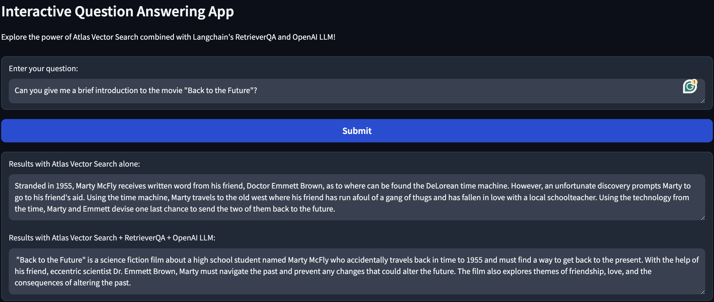

# Question Answering App using Vector Search + RAG

This project is an interactive question answering application that combines the power of Atlas Vector Search with Langchain's RetrieverQA and OpenAI LLM.

## Description

The application allows users to input a question, which is then used to retrieve relevant documents from a MongoDB database using Atlas Vector Search. The retrieved documents are then passed through Langchain's RetrieverQA and OpenAI LLM models to generate accurate answers.

## How to Use

1. Clone this repository to your local machine.
2. Install the required dependencies using `pip install -r requirements.txt`.
3. Set up your MongoDB database and ensure that it contains the necessary collections and documents.
4. Create a `.env` file and populate it with the required environment variables, such as `MONGO_URI` and `OPENAI_API_KEY`.
5. Run the application using `python app.py`.
6. Access the application through your web browser and start asking questions!

## Components

- `app.py`: Main script that initializes the Gradio user interface and connects the model to the UI.
- `model.py`: Contains the Model class, which handles the interaction between the database, retrieval models, and question answering models.
- `database.py`: Initializes the MongoDBAtlasVectorSearch database for vector search.
- `utils.py`: Contains utility functions, such as loading environment variables.
- `requirements.txt`: List of Python dependencies required for running the application.

## Configuration

Make sure to configure the following environment variables in your `.env` file:

- `MONGO_URI`: URI of your MongoDB database.
- `OPENAI_API_KEY`: API key for accessing the OpenAI service.

## Dependencies

- Gradio
- PyMongo
- Langchain
